# 6. System Design

**Project:** Event Ticket Booking System

Diagrams are given in SysML notation where the brief calls for it, with the equivalent
draw.io source in `docs/diagrams/event-ticket-booking.drawio` (multi-page). The Mermaid
versions below render directly on GitHub so the design is readable without opening draw.io.

---

## 6.1 Why SysML rather than plain UML

The brief specifies SysML notation. The two diagram types that carry the most weight here
are ones UML does not provide:

- **Requirement diagram** — makes the `«satisfy»` and `«deriveReqt»` relationships explicit,
  so the link from a requirement to the block that implements it is part of the model rather
  than prose.
- **Block Definition / Internal Block diagrams** — describe the system as blocks with ports
  and interfaces, which suits a client/server/database system better than a class diagram
  that would only describe one of those three tiers.

Behavioural views (sequence, activity, state machine) are shared between UML and SysML; they
are drawn here with SysML stereotypes where relevant.

---

## 6.2 Context — who and what the system touches

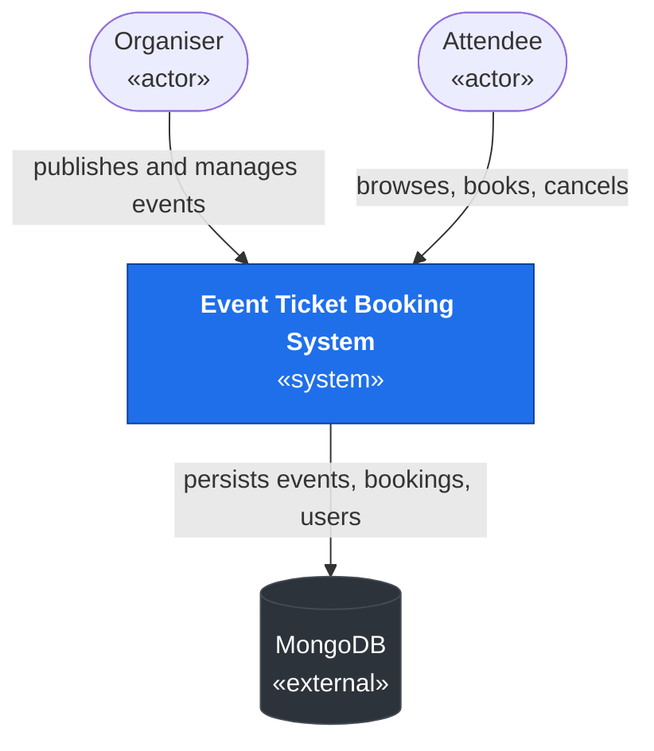

The system boundary excludes payment and notification providers — both are out of scope per
§1.6, and drawing them as external blocks would misrepresent what was built.

---

## 6.3 SysML Requirement Diagram

Shows how the requirements register decomposes and which requirements derive from others.
The full `«satisfy»` links to design elements are in the traceability matrix (§6.10).

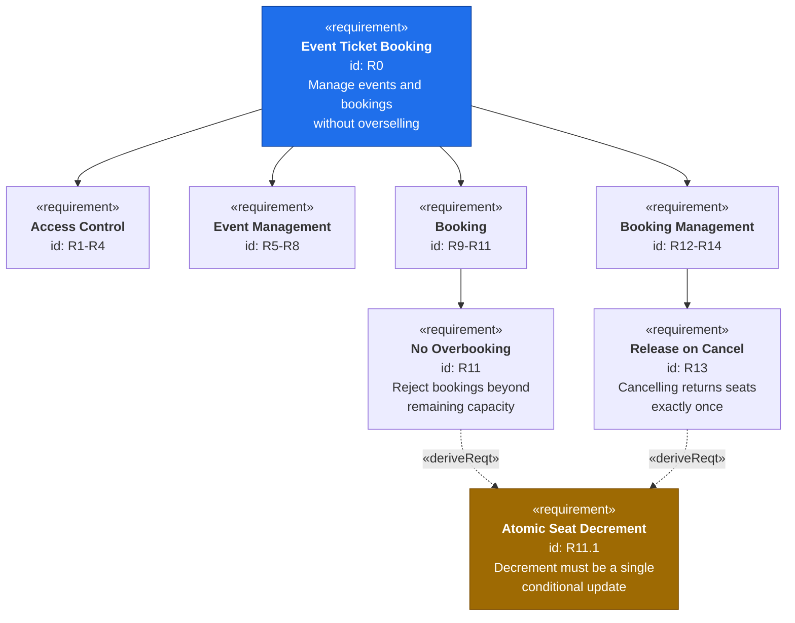

**R11.1 is a derived requirement**, not one the stakeholder asked for. It exists because
both R11 (do not oversell) and R13 (release exactly once) are unsatisfiable under concurrent
requests unless the seat count changes atomically. Deriving it explicitly is what turns
"be careful" into something testable — see US-10 AC4.

---

## 6.4 SysML Block Definition Diagram (BDD)

The structural decomposition of the system.

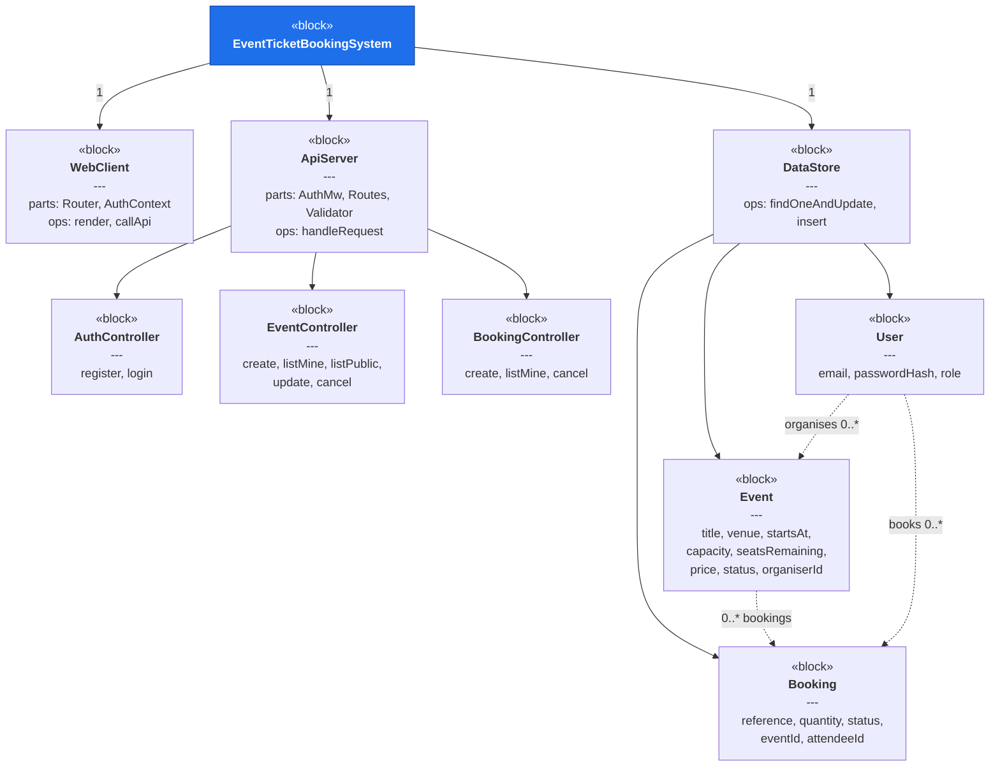

**Design decision.** Controllers are separate blocks rather than one monolithic handler
because the authorisation rules differ per controller: `EventController` needs an organiser
role plus event ownership, `BookingController` needs an attendee role plus booking ownership.
Keeping them separate makes each guard obvious at its point of use.

---

## 6.5 SysML Internal Block Diagram (IBD)

How the blocks connect, and across which interfaces.

```mermaid
graph LR
    subgraph WC["«block» WebClient"]
        UI["UI Components"]
        AC["AuthContext<br/>(holds token)"]
        HTTP["ApiClient<br/>«port» out"]
    end

    subgraph AS["«block» ApiServer"]
        IN["«port» in<br/>HTTP :5000"]
        AUTH["AuthMiddleware<br/>verify token"]
        ROLE["RoleGuard<br/>requireRole()"]
        OWN["OwnershipGuard<br/>owner == session user"]
        VAL["Validator"]
        CTRL["Controllers"]
        OUT["«port» out<br/>driver"]
    end

    subgraph DS["«block» DataStore"]
        MDB[("MongoDB<br/>:27017")]
    end

    UI --> AC
    AC --> HTTP
    HTTP -->|"«interface» REST/JSON<br/>Authorization: Bearer"| IN
    IN --> AUTH --> ROLE --> OWN --> VAL --> CTRL --> OUT
    OUT -->|"«interface» driver protocol"| MDB

    style WC fill:#1f6feb,stroke:#0d419d,color:#ffffff
    style AS fill:#238636,stroke:#1a6929,color:#ffffff
    style DS fill:#2d333b,stroke:#444c56,color:#ffffff
```

**The middleware order is the design, not an implementation detail.** Authentication must
precede the role guard (there is no role without an identity), the role guard must precede
the ownership guard (no point loading a resource for a role that cannot touch it), and
validation runs last so that a malformed body from an unauthorised caller is rejected as 403
rather than 400 — the caller learns nothing about the payload shape.

---

## 6.6 Use Case Diagram

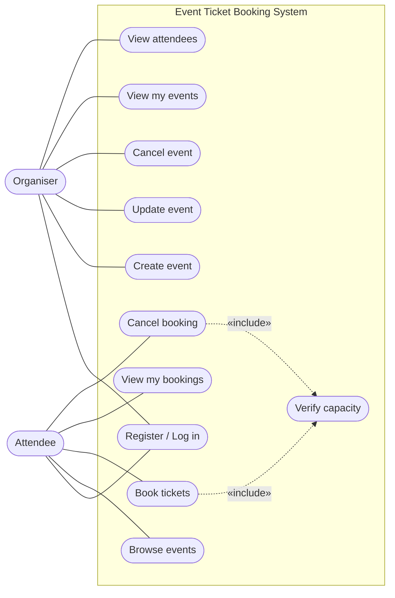

`Verify capacity` is an `«include»` on both booking and cancellation, which is the diagram
showing the same thing as the derived requirement R11.1: one shared mechanism guards both
directions of the capacity change.

---

## 6.7 Behavioural view — Sequence Diagram for W1 (book tickets)

This is the required behavioural view for the deployed end-to-end workflow. It shows the
success path **and** the two rejection paths, because the rejection paths are where the
design does its real work.

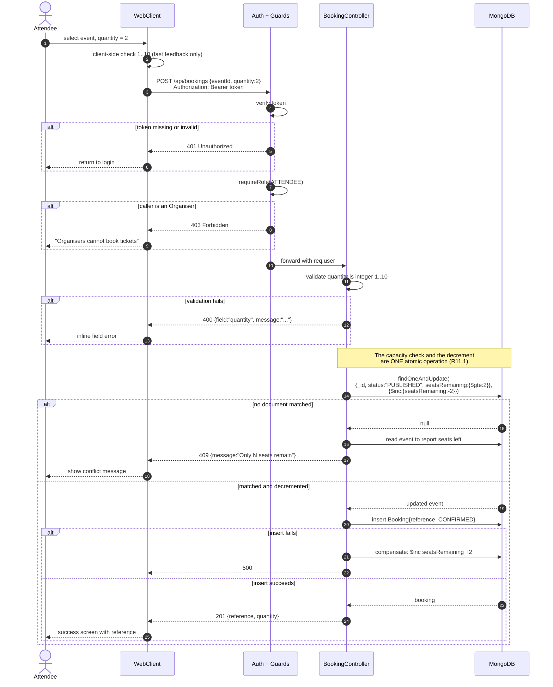

**Two things in this diagram are the whole point of the design.**

*Step ordering.* The check `seatsRemaining >= 2` is inside the same `findOneAndUpdate` filter
as the decrement. There is no moment between "there is room" and "I took the room" in which
another request can interleave. The naive alternative — read, compare, then write — has a
window there, and under the two-simultaneous-bookings test (US-10 AC4) it oversells.

*Compensation.* If the booking insert fails after the seats were taken, the seats are given
back. Without that, a failed insert would silently shrink the event's capacity forever. This
is a compensating action rather than a transaction, which is a deliberate trade-off recorded
as D-009 below.

---

## 6.8 Behavioural view — Activity Diagram for W2 (cancel and release)

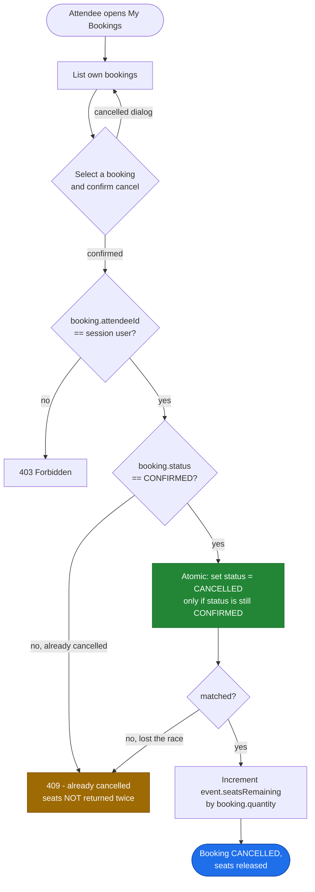

**The status guard is what prevents capacity inflation.** Guarding only the seat arithmetic
is not enough: two simultaneous cancellations of the same booking would each add the seats
back. Making the *status transition* the atomic, conditional step means exactly one of them
wins, and only the winner increments. This mirrors the booking path and is why both derive
from R11.1.

---

## 6.9 State Machine Diagrams

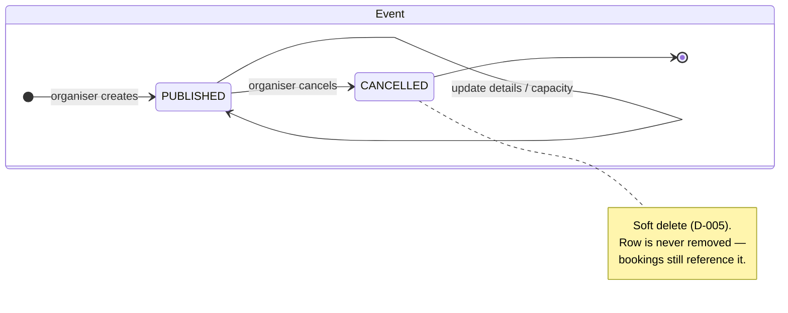

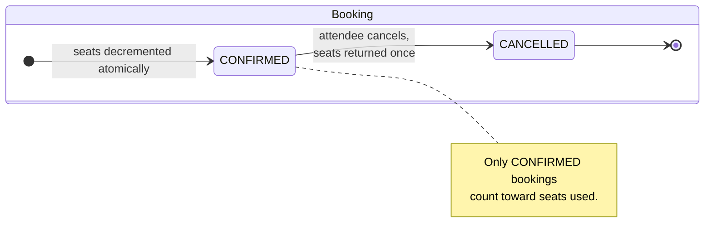

Both state machines are deliberately small. A booking has two states, not five, because
every additional state would need its own transition guard and its own test — and none of
the extra states (PENDING, PAID, REFUNDED) are reachable while payments are out of scope.

---

## 6.10 Data model

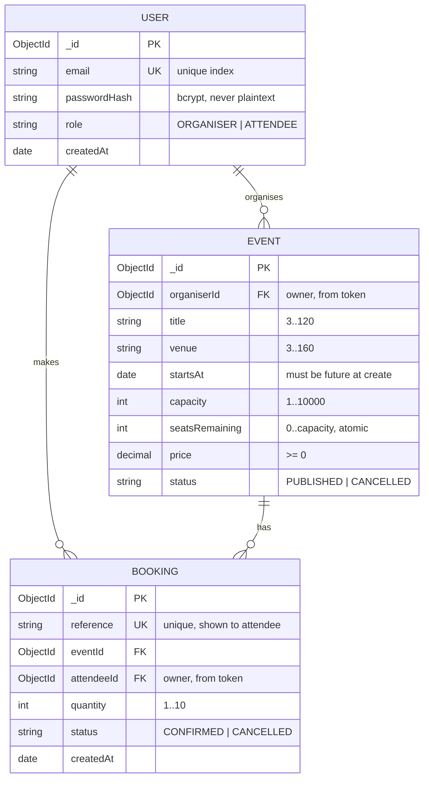

**`seatsRemaining` is stored rather than derived** — the trade-off is analysed in decision
D-004. The short version: a stored counter can be changed with one conditional atomic update,
whereas a derived count forces a read-then-write with a race window in between. Correctness
under concurrency was judged more important than immunity from drift, and the drift risk is
mitigated by the visible cross-check in US-13 AC4.

---

## 6.11 API surface

| Method | Path | Auth | Role | Ownership | Requirement |
|---|---|---|---|---|---|
| POST | `/api/auth/register` | — | — | — | R1 |
| POST | `/api/auth/login` | — | — | — | R2 |
| GET | `/api/events` | — | — | — | R9 |
| GET | `/api/events/:id` | — | — | — | R9 |
| POST | `/api/events` | required | ORGANISER | — | R5 |
| GET | `/api/events/mine` | required | ORGANISER | own only | R6 |
| PATCH | `/api/events/:id` | required | ORGANISER | must own | R7 |
| POST | `/api/events/:id/cancel` | required | ORGANISER | must own | R8 |
| GET | `/api/events/:id/bookings` | required | ORGANISER | must own | R14 |
| POST | `/api/bookings` | required | ATTENDEE | — | R10, R11 |
| GET | `/api/bookings/mine` | required | ATTENDEE | own only | R12 |
| POST | `/api/bookings/:id/cancel` | required | ATTENDEE | must own | R13 |

Twelve endpoints, each with an explicit auth/role/ownership triple. The table doubles as the
test matrix for SC4 and SC5 — every row with a role gets a wrong-role test, every row with
ownership gets a wrong-owner test.

---

## 6.12 Additional design decision

### D-009 — Compensating action instead of a multi-document transaction

| Field | Detail |
|---|---|
| **Decision** | Decrement seats, then insert the booking. If the insert fails, increment the seats back. |
| **Alternatives considered** | A multi-document transaction wrapping both writes |
| **Evidence considered** | MongoDB transactions require a replica set. A standalone `mongod` on a single EC2 instance is not a replica set, so the transactional option would force either a replica-set configuration on one host or a managed cluster — extra deployment surface during the highest-risk part of the project (RSK-02). |
| **Rationale** | The failure window is small and the compensation is exact. The ordering matters: taking the seats *first* means the worst case is a temporarily unavailable seat, not an oversold event. Reversing the order would risk a booking with no seat behind it. |
| **Trade-off accepted** | If the process dies between the two writes, the compensation never runs and the event loses those seats until corrected. This is why US-13 AC4 shows the cross-check total. |
| **Artefacts affected** | §6.7; US-09, US-10; RSK-06 |

---

## 6.13 Traceability matrix

Figma frame names are generated by `design/figma-plugin/code.js` and are prefixed with the
requirement ID, so each cell below names a frame that exists verbatim in the Figma file.

`—` means the requirement legitimately has no artefact of that kind: N2 to N6 are
non-functional and have no screen, and R3/R4 are enforced entirely in middleware.

| Req. | Story / issue | Design element | Figma frame | Commit | Deployment evidence |
|---|---|---|---|---|---|
| R1 | SCRUM-6 · US-01 Register with a role | AuthController.register; User block (§6.4) | `R1 - Register`, `R1 - Register (validation errors)` | *[on implementation]* | *[on deployment]* |
| R2 | SCRUM-7 · US-02 Log in | AuthController.login; AuthMiddleware (§6.5) | `R2 - Login`, `R2 - Login (error)` | *[on implementation]* | *[on deployment]* |
| R3 | SCRUM-7 · US-02 AC3 | AuthMiddleware (§6.5) | — | *[on implementation]* | *[on deployment]* |
| R4 | SCRUM-8 · US-03 Role protection | RoleGuard, OwnershipGuard (§6.5) | — | *[on implementation]* | *[on deployment]* |
| R5 | SCRUM-9 · US-04 Create an event | EventController.create; Event block | `R5 - Create Event`, `R5 - Create Event (validation errors)` | *[on implementation]* | *[on deployment]* |
| R6 | SCRUM-10 · US-05 View my events | EventController.listMine | `R6 - Organiser Dashboard`, `R6 - Organiser Dashboard (empty)` | *[on implementation]* | *[on deployment]* |
| R7 | SCRUM-11 · US-06 Update an event | EventController.update | `R7 - Edit Event` | *[on implementation]* | *[on deployment]* |
| R8 | SCRUM-12 · US-07 Cancel an event | EventController.cancel; Event state machine (§6.9) | `R8 - Cancel Event Confirm` | *[on implementation]* | *[on deployment]* |
| R9 | SCRUM-13 · US-08 Browse events | EventController.listPublic | `R9 - Event Listing`, `R9 - Event Listing (empty state)` | *[on implementation]* | *[on deployment]* |
| R10 | SCRUM-14 · US-09 Book tickets | BookingController.create; sequence §6.7 | `R10 - Book Tickets`, `R10 - Booking Success` | *[on implementation]* | *[on deployment]* |
| R11 | SCRUM-15 · US-10 No overbooking | Atomic findOneAndUpdate (§6.7); derived R11.1 | `R11 - Sold Out / Capacity Conflict` | *[on implementation]* | *[on deployment]* |
| R12 | SCRUM-16 · US-11 View my bookings | BookingController.listMine | `R12 - My Bookings`, `R12 - My Bookings (empty)` | *[on implementation]* | *[on deployment]* |
| R13 | SCRUM-17 · US-12 Cancel my booking | BookingController.cancel; activity §6.8 | `R13 - Cancel Booking Confirm` | *[on implementation]* | *[on deployment]* |
| R14 | SCRUM-18 · US-13 View attendees | EventController.listBookings | `R14 - Attendee List` | *[on implementation]* | *[on deployment]* |
| N1 | SCRUM-6, SCRUM-9 | Validator (§6.5); validation table §1.10 | `R1 - Register (validation errors)`, `R5 - Create Event (validation errors)` | *[on implementation]* | *[on deployment]* |
| N2 | SCRUM-6 · US-01 AC4 | bcrypt hashing in AuthController | — | *[on implementation]* | *[on deployment]* |
| N3 | SCRUM-19 · US-14 | `.gitignore`, `.env.example` | — | `5ea31db` | n/a — repository hygiene |
| N4 | SCRUM-20 · US-15 AC4 | DataStore block (§6.4) | — | *[on implementation]* | *[on deployment]* |
| N5 | SCRUM-20 · US-15 | Deployment view (§6.14) | — | *[on implementation]* | *[on deployment]* |
| N6 | SCRUM-20 · US-15 AC3 | Security group configuration (§6.14) | — | *[on implementation]* | *[on deployment]* |

**Why the last two columns are not yet filled.** A commit hash and a deployment URL are
evidence that something was built and deployed. Neither exists yet for R1–R14, so any value
written there now would be invented, and a marker can verify both against the live
repository and the live instance in seconds. These cells are completed as each story is
implemented — a commit prefixed with its requirement ID (per decision D-008) and, after
deployment, the URL path that demonstrates it.

---

## 6.14 Deployment view

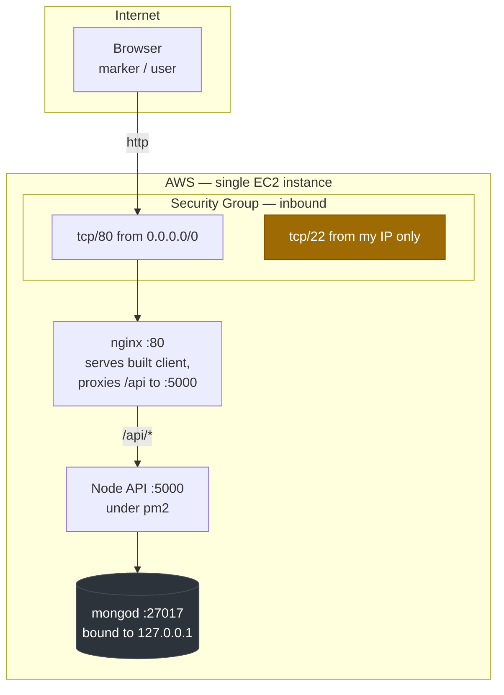

Three deliberate choices satisfy N6:

- **MongoDB binds to `127.0.0.1`**, so the database is unreachable from the internet even
  though it runs on the same host. Port 27017 is never opened in the security group.
- **Port 22 is restricted to a single IP**, not `0.0.0.0/0`. An SSH port open to the world is
  the most common finding in student deployments.
- **Only port 80 is public.** The Node process on 5000 is reached only through the nginx
  proxy, so there is one public entry point rather than two.
